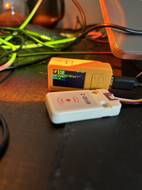

# RFID2



## Overview

This RFID2 project is designed for the M5StickC Plus, a portable and versatile ESP32-based development kit with a built-in display. 
The project allows you to read and clone MIFARE Classic RFID cards using an MFRC522 RFID module and the M5StickC Plus.

## Features

- Read and display information from MIFARE Classic RFID cards.
- Clone MIFARE Classic RFID cards.

## Hardware Requirements

To set up this project, you will need the following hardware:

- M5StickC Plus
- MFRC522 RFID module
- MIFARE Classic RFID cards

## Installation

1. Clone this repository to your local environment.
2. Upload the provided code to your M5StickC Plus using the Arduino IDE or PlatformIO.
3. Connect the MFRC522 RFID module to your M5StickC Plus.
4. Power on the M5StickC Plus.

### Arduino CLI

```bash
# compile (you need to specify the folder)
arduino-cli compile --fqbn m5stack:esp32:m5stack_stickc_plus2 -e --build-property build.partitions=huge_app --build-property upload.maximum_size=3145728 ./copyrfid/copyrfid.ino

# upload (you need to check if the usb port is correct, and don't forget to name correctly the sketch "copyrfid")
arduino-cli upload -p /dev/tty.{CHANGE ME TO YOUR PORT} --fqbn m5stack:esp32:m5stack_stickc_plus2 copyrfid
```


## Usage

- When you power on the M5StickC Plus, it will be in "Read Mode." Press the 'A' button to switch between "Read Mode" and "Write Mode."
- In "Read Mode," the device will read and display information from MIFARE Classic RFID cards.
- In "Write Mode," you can write the UID of a card to another card by presenting it to the MFRC522 module.

## Troubleshooting

- If the display text overlaps, the code has adjustments to minimize the issue, such as reducing text size and moving the error message down.
- Ensure the hardware connections are correct.
- Make sure you have MIFARE Classic RFID cards to read and clone.

## Contributions

Contributions to this project are welcome. Feel free to fork this repository and submit pull requests for improvements or new features.

## License

This project is licensed under the [MIT License](LICENSE).

## Acknowledgments

- This project is based on the MFRC522 library.
- Developed for educational and experimental purposes.
---
- Created originally by Sarah-C, in the project called M5Stack_Core_MFRC522_RFID_Cloner

## Credits

- [Sarah-C](https://github.com/Sarah-C)
- [Repo ref](https://github.com/Sarah-C/M5Stack_Core_MFRC522_RFID_Cloner)
